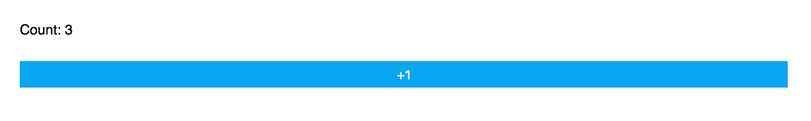
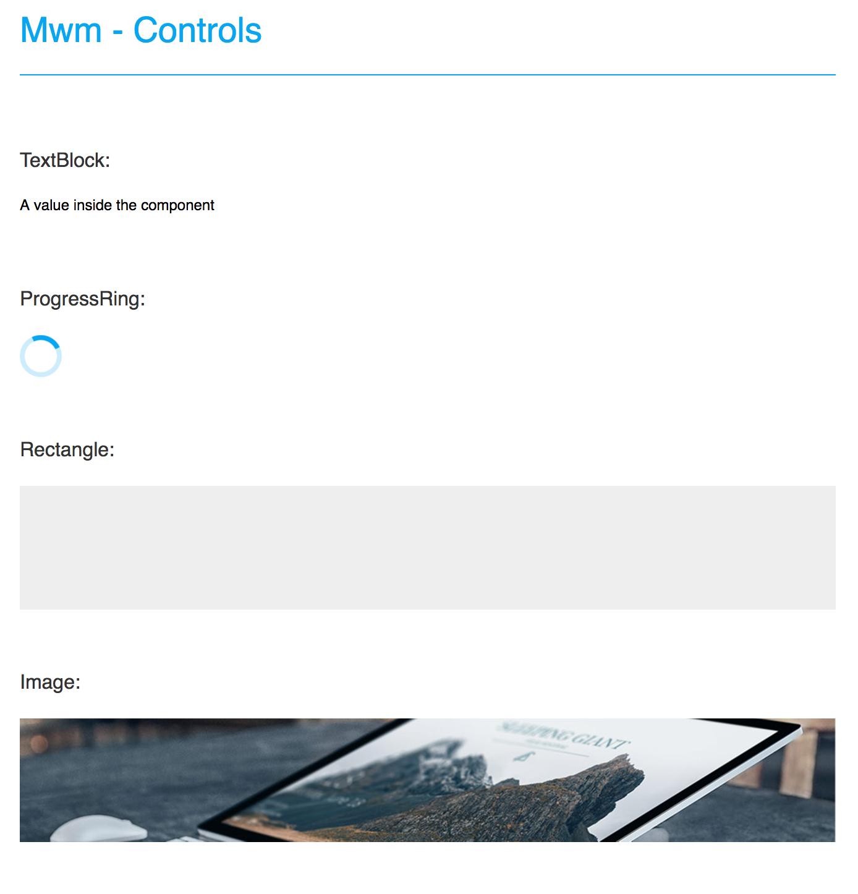
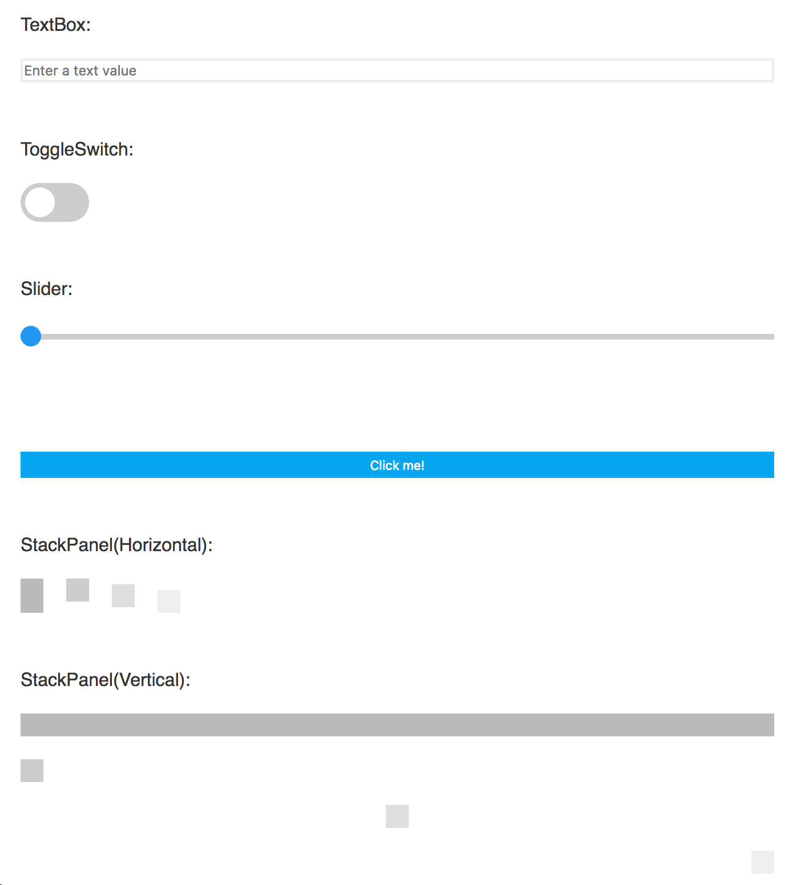

# Mwm

Build web interfaces with XAML markup language and bind it to the same view models than your mobile or desktop applications.

## Disclaimer

**Mwm** is purely **experimental**. It's absolutely not thought to be production-ready, this is more a proof-of-concept of a naïve implementation on top of [ASP.NET Core](https://www.asp.net/core/overview/aspnet-vnext) and [Websockets](https://developer.mozilla.org/fr/docs/WebSockets).

To sumarize : it's just me having fun with technologies I don't know yet! You can expect ugly code and bad architecture since all of this has been made in one go ... without a clean design phase.

Moreover it's only been tested with **Google Chrome - Version 59.0.3071.115 (64-bit)** and **Firefox - Version 54.0**, running on **macOS 10.12**.

## Quickstart



**Home.xaml**

```xaml
<Page
    xmlns="http://schemas.microsoft.com/winfx/2006/xaml/presentation"
    xmlns:x="http://schemas.microsoft.com/winfx/2006/xaml"
    x:Class="Mwm.Sample.Home">
    <StackPanel Margin="10">
        <TextBlock x:Name="title" Margin="10" Text="Count: 0"  />
        <Button Margin="10" Text="+1" Click="Add" />
    </StackPanel>
</Page>
```

**Home.xaml.cs**

```csharp
namespace Mwm.Sample
{
	using System;

	public partial class Home
	{
		public Counter()
		{
			this.Initialize();
		}

		private int count;

		private void Add(object sender, EventArgs args)
		{
			this.title.Text = $"Count: {++count}";
		}
	}
}
```

**Startup.cs**

```csharp
public void Configure(IApplicationBuilder app, IHostingEnvironment env, ILoggerFactory loggerFactory)
{
	loggerFactory.AddConsole(Configuration.GetSection("Logging"));
	loggerFactory.AddDebug();
	app.UseWebSockets();
	app.UseMwm(new MwmOptions
	{
		UIBuilder = new FactoryBuilder().Register<Home>(),
	});
}
```

## Samples

Clone the repository and start the Mwm.Sample project to preview three samples :

* **Counter** : the quickstart with a simple web page interracting with the .NET backend.


* **Controls** : the list of available controls.





* **Weather (WIP)** : an example of a weather application based on MVVM architecture.

*screenshot soon ...*

## Roadmap

- [ ] Improvements
	- [ ] Integrate Typescript
	- [ ] Integrate SignalR
	- [ ] Cleaner architecture  
	- [ ] Better browser compatibility
- [X] Middleware
	- [X] Sending property changes
	- [X] Receiving events
	- [X] Navigation
		- [X] Forward
		- [ ] Backward & history 
- [X] XAML
	- [X] Generation 
- [ ] UI 
	- [ ] User controls 
	- [ ] Styles
		- [ ] ResourceDictionaries
		- [ ] Style & setter 
	- [ ] Bindings
		- [X] One way 
		- [X] Two way 
		- [ ] One time
		- [ ] Converters
	- [X] Displays
		- [X] TextBlock
		- [X] Image
		- [X] Rectangle
		- [X] ProgressRing
		- [ ] ProgressBar
		- [ ] Border
	- [ ] Controls
		- [X] TextBox
		- [X] ToggleSwitch
		- [ ] Slider
		- [ ] DatePicker
		- [ ] ComboBox
		- [ ] RadioButton
	- [ ] Panels
		- [X] StackPanel
		- [ ] Grid
		- [ ] ScrollView
	- [ ] Virtualization
		- [ ] ListView

## How it works

#### Synchronization

All the logic is executed by an ASP.NET Core middleware that sends and listen to commands from a web app. All property changes, user interaction events, navigation are propagated to the javascript client through WebSockets.

**Details** : [MwmMiddleware.cs](MwmMiddleware.cs), [ElementObserver.cs](ElementObserver.cs)

#### Components & XAML Generation

A custom simplified XAML layer have been built from ground up for control. The components and the generation are very basic at the moment. All XAML will generate C# file at build time. Theorically, the same concept should be applyable to *Xamarin.Forms* but with a lot more work. :)

**Details** : [Mwm.UI](Mwm.UI), [Mwm.UI.Xaml.Build](Mwm.UI.Xaml.Build)

### Contributions

Contributions are welcome! If you find a bug please report it and if you want a feature please report it.

If you want to contribute code please file an issue and create a branch off of the current dev branch and file a pull request.

### License

MIT © [Aloïs Deniel](http://aloisdeniel.github.io)